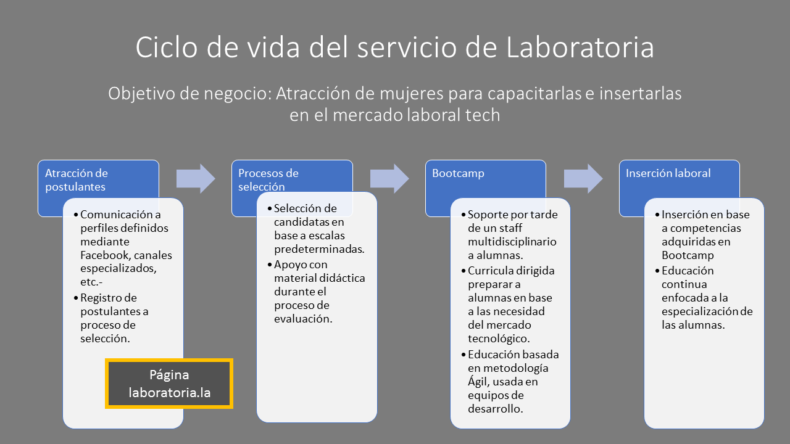
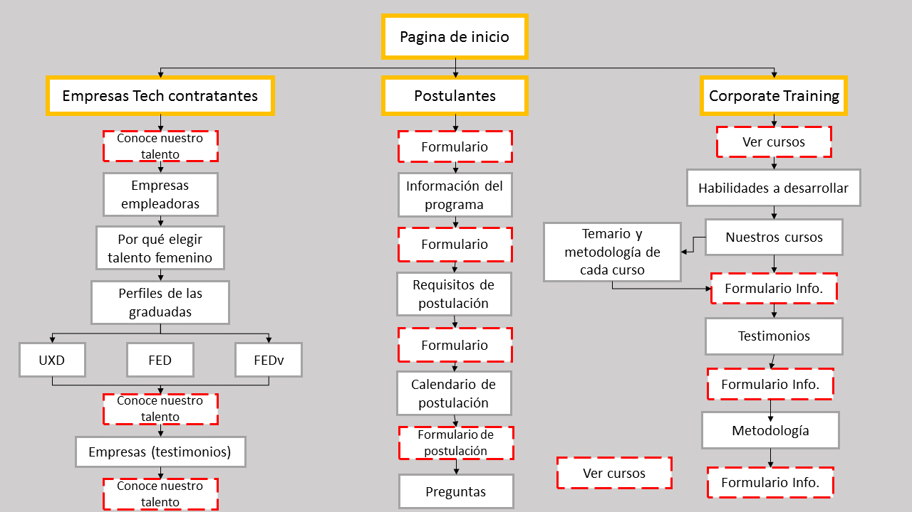
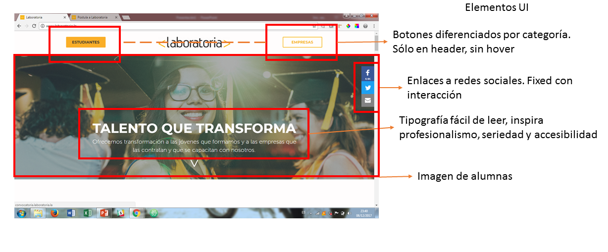
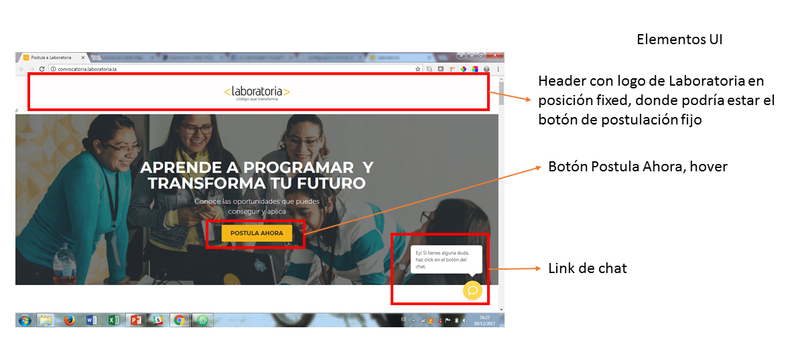
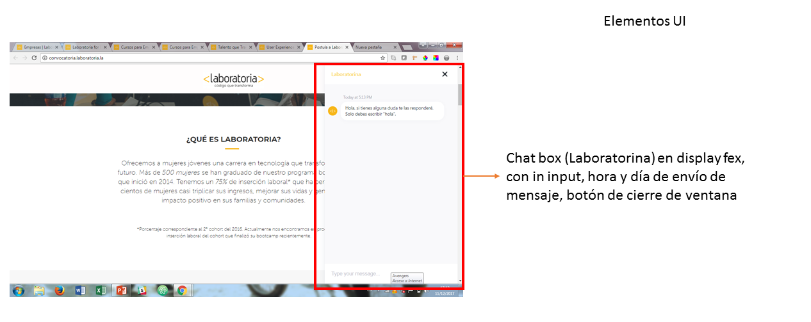
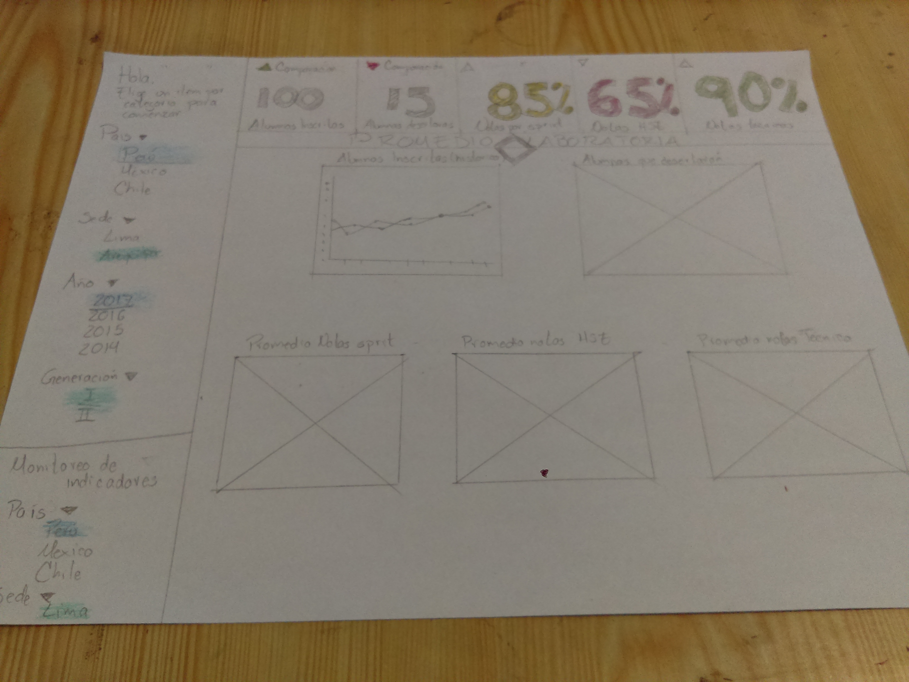
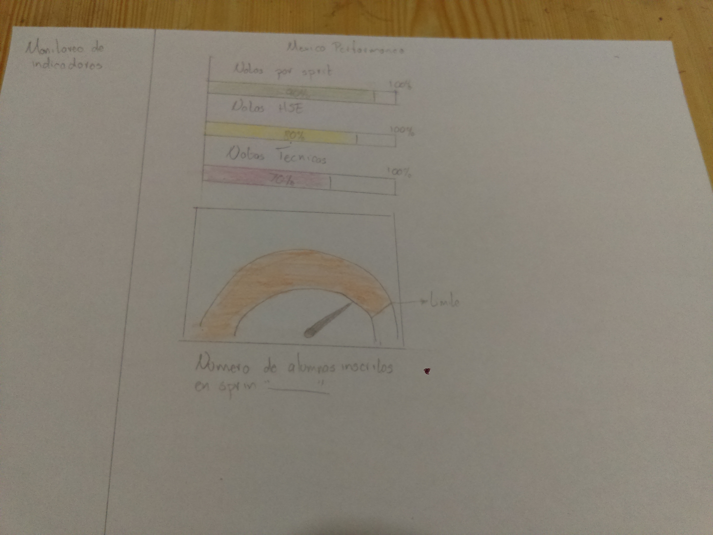
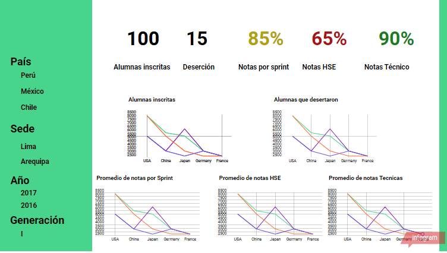
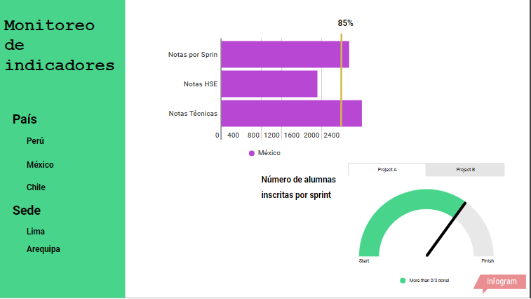

# Análisis UX y UI laboratoria.la

## Objetivo:
  Identificar los elementos UI utilizados y analizar los elementos UX en la página laboratoria.la

### Especificaciones

Comenzaré el análisis de la página de laboratoria.la partir de su objetivo de negocio, el cual visualizo como: Atracción de mujeres para capacitarlas e insertarlas en el mercado laboral tech. El principal objetivo de la página de Laboratoria debe ser el captar al mayor número posible de postulantes a los procesos de selección.

La página laboratoria.la es el único medio por el cual las aspirantes pueden registrarse al proceso de selección por lo que analizará el path que tienen que seguir

##### Análisis UX

En la página principal los principales detonadores a realizar una acción son los botones de redes sociales, “Estudiantes” y “Empresas”, sin embargo, estos últimos dos botones no tienen hover o algún efecto que destaque al pasar el cursor por ellos, esto podría hacer que se pase desapercibido la opción “Estudiantes”. En cuestión de comunicación la palabra “estudiantes” hace referencia a quienes ya pertenecen a una institución educativa.

Al ingresar a la opción “Estudiantes”, se encuentra el primer call to action, el botón “Postula Ahora”, el cual es plano (sin hover) junto a una frase que invita a conocer más de Laboratoria y a postular.

Las secciones ¿qué es Laboratoria? y ¿cómo funciona?, tienen información concreta y clara, sin embargo, se puede poner una leyenda de “Más información”, “Tienes dudas”, en tipo de navegación en línea que dirija a la sección de preguntas y respuestas. Esta acción mantendrá informado al usuario sobre donde encontrar los datos específicos que pueda necesitar.

Al seccionar la página en secciones tendremos mejor control sobre la información el flujo de la información, sin embargo, sin un indicativo de botón “Next” el usuario puede saltarse información que le dará el panorama completo sobre el proceso de selección.

Dentro de la sección “Calendario de postulación”, se podría mostrar más a detalle el estatus de las convocatorias por sede. Se podría incluir los rubros:

*	Inicio a definir: Opción para “avisar” cuando se abra la convocatoria.
*	Inicia en “fecha”: Informar el paso donde se encuentra la convocatoria, en caso de estar en etapa de registro, redirigir a formulario de postulación.
*	Si la convocatoria está en la fase de registro “Abierta” poner el link del formulario lo más visible posible.

Como recomendación mantendría en posición fixed al lado derecho de la pantalla o en el header que ya es fijo un link al formulario de postulación, para que el usuario tenga presente en todo momento donde hacer su postulación. Junto con este cambio el formulario lo colocaría en una ventana modal para que en caso de que el usuario quiere seguir consultando información pueda volver con facilidad a esta y seguir teniendo acceso al formulario en todo momento.

Como propuesta se podría incluir una sección de testimonios/historias de éxito de alumnas graduadas para conectar con las futuras postulantes.

##### Análisis UI

# Elementos de navegación Github

## Objetivo:
   Identifica los elementos de navegación en la página Github

Al ser una página que permite la busqueda de repositorios la navegación facetada y filtrada se maneja en todo momento. Podemos notar que el menu principal queda como navegación global permitiendo al usuario tener acceso a las opciones predeterminadas del sitio. Los filstros predetermnados en las busquedas permiten encontrar elemntos conocidos al usuario.

# Sketch Dashboard para Laboratoria

## Objetivo:
Elaborar un sketch de un dashboard donde profesores, training managers, directores y gerentes de Laboratoria pueda consultar información relevante para ellos como:

* Número de alumnas inscritas
* Número de alumnas que desertaron
* Número y % de alumnas que pasan el criterio mínimo de evaluación
* Promedio de notas por sprint
* Promedio de notas HSE
* Promedio de notas técnicas

#### Características del dashboard

1. Presentar información clara y relevante
2. Por default se mostrará el promedio Laboratoria de la generación en curso

#### Elementos del dashboard

1. Barra lateral de navegación. Desplegable y retraible con mouse over
  * En ella se desplegaran las opciones para realizar comparaciones.
  * Los items a elegir serán: pasís, sede, año, generacion. Los dos items clave son país y año, al seleccionar cualquiera de ellos, desplegara las opciones filtradas del siguiente item (sede y generación)

2. Barra superior. Semaforo de estados
  * Por default se mostrarán datos promedio de la generación actual de Laboratoria.
  * Datos a mostrar: número de alumnas inscritas y número de alumnas que desertaron. La cual se mostrará en el icono "comparacion" de acuerdo a semaforo preestablecido.
  * Datos a mostrar: promedio de notas por sprint, HSE y tecnicas.
  * Al seleccionar de la barra lateral de navegación tantas combinaciones como se elija, se pintará los datos en filas.
  * La seccion tendra un icono para mostrar u ocultar la seccion de pendiendo de las necesidades de información

  3. Gráficas de promedios historicos. En esta seccion de mostrarán las graficas de los cinco datos relevantes.
    * Al seleccionar el la barra lateral de navegación tantas combinaciones como se elija, se pintaran los datos seleccionados en cada grafica.
    * Se mantendra el dato promedio de Laboratoria (validar si es relevante)
    * La seccion tendra un icono para mostrar u ocultar la seccion de pendiendo de las necesidades de información

  4. Seccion de control de indicadores. Dependiendo de los indicadores establecidos por Laboratoria se propone la sección donde se replicará el semaforo de estados. Este dato se actualizará cada cierre de sprint y se coloreará dependiento del semaforo de desempeño preestablecido.
    * Esta sección solo aparecerá (tamando el lugar de los semaforos de estado y las graficas de promedio) si se selecciona un pais y sede, ya que el monitoreo se hará sobre la generación en curso.
    * Los datos se alimentarán de reportes enviados y se hará una comparacion mensual, semanal o por sprint (dependiendo de las necesidades).

